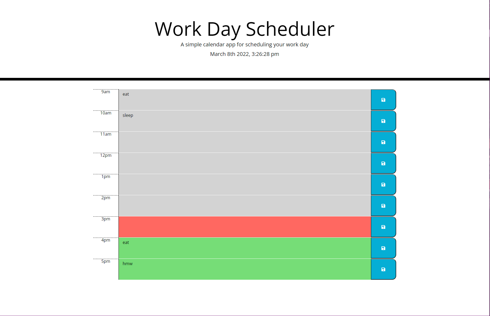

Challenge 5: Josh's Work Day Scheduler

The starter code was refactored by adding a Javascript file which created rows/columns, displayed date/time with color coding, and allowed the schedule to be saved to local storage.

User Story:
As an employee with a busy schedule, I want to add important events to a daily planner, so that I can manage my time effectively.

Acceptance Criteria:
Given I am using a daily planner to create a schedule, when I open the planner, then the current day is displayed at the top of the calendar. When I scroll down, then I am presented with time blocks for standard business hours. When I view the time blocks for that day, then each time block is color-coded to indicate whether it is in the past, present, or future. When I click into a time block, then I can enter an event. When I click the save button for that time block, then the text for that event is saved in local storage. When I refresh the page, then the saved events persist.

Link to deployed application: https://joshahuynh.github.io/work-day-scheduler/

Link to the GitHub repository: https://github.com/joshahuynh/work-day-scheduler

Screenshot:

